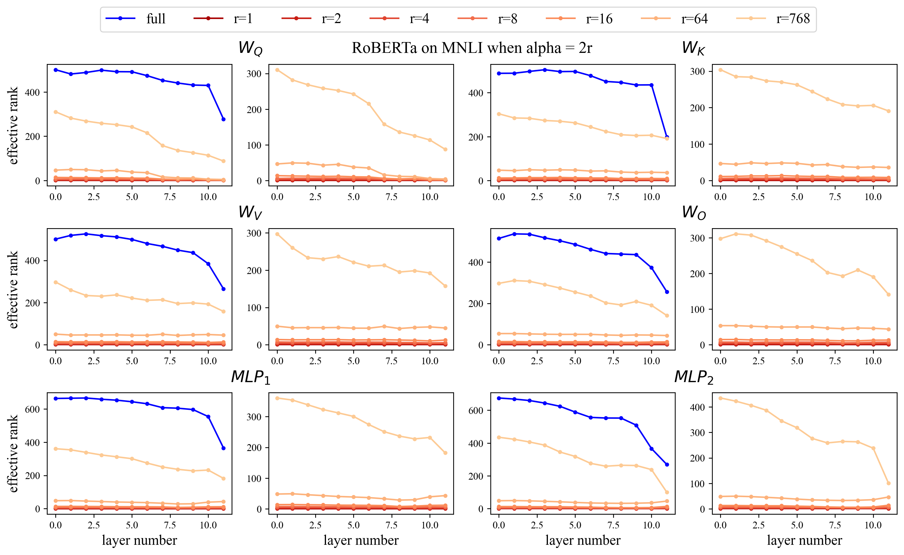
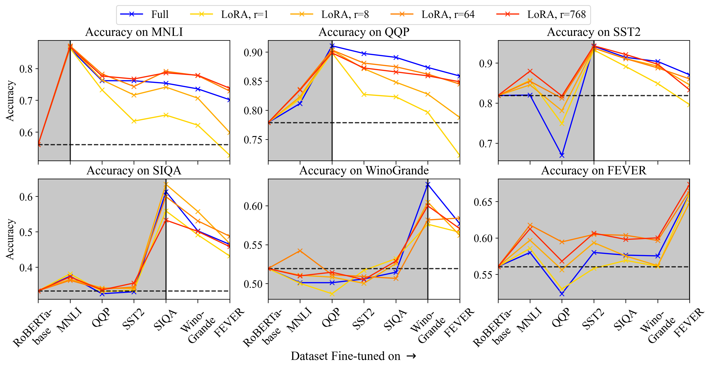
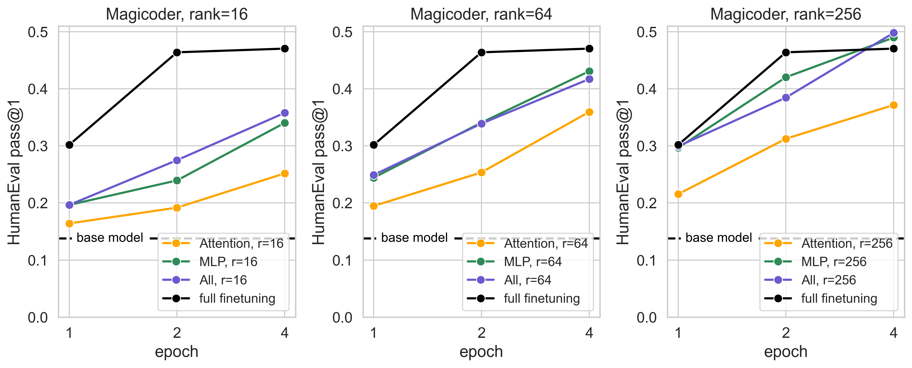

## Tinh chỉnh mô hình (text compilation)

### Tập dữ liệu sử dụng

MCQ tin học: https://huggingface.co/datasets/beyoru/Tin_hoc_mcq
Contexts: được tạo bằng GPT4o

### Why $\alpha$ and rank $r$ is important

Trong LoRA, $\alpha$ được cho là một trong những tham số quan trọng trong quá trình tinh chỉnh, việc tinh chỉnh tham số này sẽ dẫn tới nhiều kết quả khác nhau.

"LoRA vs Full Fine-tuning: An Illusion of Equivalence"\_ là một bài báo được công bố 10/2024. Ta sẽ không đi vào từng từng chi tiết ý tưởng cũng như là kết quả của họ. Thay vào đó ta sẽ tìm hiểu và phân tích bài báo này

Họ có đề cập đến một thuật ngữ gọi là **_intruder dimensions_**. Để phân tích ta cần hiểu về SVD (Singular Value Decomposition).

**_
$W = U \Sigma V^{T}$
_**

Trong đó
$U \in R^{m \times m}$ là ma trận trực giao, chứa vector kì dị trái
$V \in R^{n \times n}$ là ma trận trực giao, chứa các vector kỳ dị phải
$\Sigma \in R^{m \times n}$ là ma trận đường chéo chứa các giá trị kỳ dị giảm dần $\sigma_1 > \sigma_2 > ... \geq 0$

Ở đây ta sẽ không nhắc lại LoRA về cơ bản là như này:

**_
$W_{lora} = W*{pretrained} + \Delta W (AB, A \in R^{m \times r}, B \in R^{r \times n} )$
***

Intruder Dimensions qua SVD => $W_{lora} = U_{lora} \Sigma_{lora} V^{T}_{lora}$

So sánh với pretrained SVD các **_IDs_** sẽ là

- $\sigma_{new}$ hay giá trị kì dị mới lớn hơn không có trong $W_{pretrained}$. Chúng đại diện cho các thành phần thông tin mới được thêm của LoRA
- Vector kì dị mới $(u_{new}, v_{new})$ sẽ tương ứng với các giá trị kì dị mới. Chúng biểu thị các chiều mới mà mô hình sử dụng để biểu diễn thông tin của nhiệm vụ fine-tuning.

**_
Full fine-tuning updates have a higher effective rank than LoRA updates, even when LoRA is performed with a full-rank matrix
_**

Đây là một nhận định rõ ràng là chính xác khi mà FFT trực tiếp cập nhật các trọng số được biết là _rank_ cao. Về cơ bản LoRA vẫn _bắt_ các mô hình phải cập nhật một cách hạn chế.

Họ cũng nhận xét rằng ở rank thấp, LoRA thích ứng kém trong quá trình học liên tục khi quên đi các nhiệm vụ trước đó.

### Why forget

LoRA quên ít hơn so với FFT. Vấn đề quên có thể tệ hơn nếu như ta đặt quá nhiều `epochs` trong huấn luyện. Vậy có thể kiểm soát chúng ? Có, bằng cách điều chỉnh rank khi tinh chỉnh.
Sự đánh đổi của việc học là quên: Model sẽ học được điều gì mới chủ yếu ở trong khoảng epoch từ [1,8] và dần dần kém đi (LoRA Learns Less and Forgets Less). Nhớ rằng tất cả những gì ta làm là cố gắng thay đổi tham số của mô hình $W_{finetuning} = W_{PT} + \Delta$ sao cho mô hình sẽ đạt được đầu ra mong muốn

Như đã đề cập mô hình sẽ học được điều gì đó mới trong khoảng nào đó, khi đó nó sẽ quên đi các kiến thức ban đầu vốn trong PT, điều này có 2 mặt khi có thể giảm hoặc cũng có thể tăng hiệu suất mô hình.
Nếu muốn mô hình học nhiều hơn thì hãy sử dụng rank cao hơn, nhưng đồng nghĩa với việc sẽ đánh đổi việc quên đi nhiều hơn. Đối với các task đơn giản không đưa ra rank quá cao (chọn 8, 16). Hiệu suất của LoRA sẽ tương đồng với FFT nếu như ta đặt rank cao hơn, apply với các lớp emb_tokens và lm_head, attention và mlp (Linear layer).

**Tóm lại nếu như dữ liệu không cung cấp một cái gì mới mẻ cho mô hình thì giảm rank xuống**
